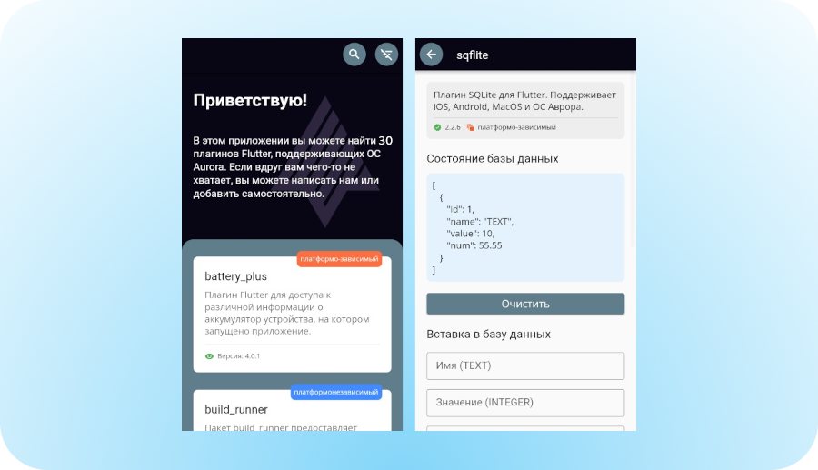

    

# Плагины для ОС Аврора

Этот репозиторий содержит Flutter плагины для платформы ОС Аврора. Мы находимся в процессе создания необходимых плагинов для разработки всевозможных приложений пользователей.

Если плагин который вы ищете еще не реализован для ОС Аврора оставьте свое сообщение в [issue](https://gitlab.com/omprussia/flutter/flutter-plugins/-/issues), либо рассмотрите возможность самостоятельной разработки плагина для развития Open Source сообщества ОС Аврора. Мы будем рады вашим мерж-реквестам!

# Разработка плагина для ОС Аврора

Подробно процесс создания платформозависимых плагинов описан в статье [«Flutter на ОС Аврора»](#todo).

Если у вас имеются вопросы, присоединяйтесь к [сообществу](https://t.me/aurora_devs) ОС Аврора в Telegram канале, где вы сможете задать интересующий вас вопрос и следить за всеми актульными новостями.

Для разработки платформозависимого плагина, необходимо использовать адаптированный под ОС Аврора [Flutter SDK](https://gitlab.com/omprussia/flutter/flutter).

Ниже перечислены четыре вида плагинов, которые могут
применяться в ОС Аврора.

- ### Dart Package

    Пакет написанный на языке Dart, например пакет [`path`](https://pub.dev/packages/path), расширяющий возможности Flutter, добавляя в него новые виджеты или функции, который не является платформозависимым.

- ### Plugin Package

    Пакет, предоставляющий API ны языке Dart в сочетании с одной или несколькими реализациями под конкретные платформы, использующий механизм [Platform Channels](https://docs.flutter.dev/platform-integration/platform-channels).
    Для реализации плагина под ОС Аврора используется язык C++.

- ### Qt Plugin Package

    Пакет, аналогичный `Plugin Package`, но использующий в реализации под ОС Аврора библиотеку Qt. Данный вид пакета используется в случае, если системное API ОС Аврора, предоставляющее необходимую функциональность, использует библиотеку Qt.

    ОС Аврора старается минимизировать использование библиотеки Qt в Flutter плагинах, поэтому, если имеется возможность не использовать библиотеку Qt в реализации плагина под ОС Аврора, то лучше ее не использовать.

- ### FFI Plugin Package

    Пакет, предоставляющий API ны языке Dart в сочетании с одной или несколькими реализациями под конкретные платформы, использующий механизм [Dart FFI](https://dart.dev/guides/libraries/c-interop).

# Демонстрационное приложение

Плагины из данного проекта объеденены в одно [общее приложение](./example), предназначеное для демонстрации работы реализованных и проверенных на ОС Аврора плагинов.

    

# Платформозависимые плагины Flutter

Список платформозависимых плагинов, реализованых под ОС Аврора, либо зависящих от платформозависимых плагинов.

| Плагин ОС Аврора                                                                                                                                                                 | Версия  | Внешний плагин                                                                      | Версия   | Версия ОС Аврора   |
|----------------------------------------------------------------------------------------------------------------------------------------------------------------------------------|---------|-------------------------------------------------------------------------------------|----------|--------------------|
| [battery_plus_aurora](https://gitlab.com/omprussia/flutter/flutter-plugins/-/tree/master/packages/battery_plus/battery_plus_aurora)                                              | `0.0.1` | [battery_plus](https://pub.dev/packages/battery_plus)                               | `4.0.1`  | `4.0.2.269`        |
| [device_info_plus_aurora](https://gitlab.com/omprussia/flutter/flutter-plugins/-/tree/master/packages/device_info_plus/device_info_plus_aurora)                                  | `0.0.1` | [device_info_plus](https://pub.dev/packages/device_info_plus)                       | `8.2.2`  | `4.0.2.269`        |
| [flutter_keyboard_visibility_aurora](https://gitlab.com/omprussia/flutter/flutter-plugins/-/tree/master/packages/flutter_keyboard_visibility/flutter_keyboard_visibility_aurora) | `0.0.1` | [flutter_keyboard_visibility](https://pub.dev/packages/flutter_keyboard_visibility) | `5.4.1`  | `4.0.2.269`        |
| [flutter_local_notifications_aurora](https://gitlab.com/omprussia/flutter/flutter-plugins/-/tree/master/packages/flutter_local_notifications/flutter_local_notifications_aurora) | `0.0.1` | [flutter_local_notifications](https://pub.dev/packages/flutter_local_notifications) | `14.1.1` | `4.0.2.269`        |
| [flutter_secure_storage_aurora](https://gitlab.com/omprussia/flutter/flutter-plugins/-/tree/master/packages/flutter_secure_storage/flutter_secure_storage_aurora)                | `0.0.1` | [flutter_secure_storage](https://pub.dev/packages/flutter_secure_storage)           | `8.0.0`  | `4.0.2.269`        |
| [package_info_plus_aurora](https://gitlab.com/omprussia/flutter/flutter-plugins/-/tree/master/packages/package_info_plus/package_info_plus_aurora)                               | `0.0.1` | [package_info_plus](https://pub.dev/packages/package_info_plus)                     | `3.1.2`  | `4.0.2.269`        |
| [path_provider_aurora](https://gitlab.com/omprussia/flutter/flutter-plugins/-/tree/master/packages/path_provider/path_provider_aurora)                                           | `0.0.1` | [path_provider](https://pub.dev/packages/path_provider)                             | `2.0.15` | `4.0.2.269`        |
| [shared_preferences_aurora](https://gitlab.com/omprussia/flutter/flutter-plugins/-/tree/master/packages/shared_preferences/shared_preferences_aurora)                            | `0.0.1` | [shared_preferences](https://pub.dev/packages/shared_preferences)                   | `2.1.2`  | `4.0.2.269`        |
| [sqflite_aurora](https://gitlab.com/omprussia/flutter/flutter-plugins/-/tree/master/packages/sqflite/sqflite_aurora)                                                             | `0.0.1` | [sqflite](https://pub.dev/packages/sqflite)                                         | `2.2.6`  | `4.0.2.269`        |
| [wakelock_aurora](https://gitlab.com/omprussia/flutter/flutter-plugins/-/tree/master/packages/wakelock/wakelock_aurora)                                                          | `0.0.1` | [wakelock](https://pub.dev/packages/wakelock)                                       | `0.6.2`  | `4.0.2.269`        |
| [xdga_directories](https://gitlab.com/omprussia/flutter/flutter-plugins/-/tree/master/packages/xdga_directories)                                                                 | `0.0.1` | -                                                                                   | -        | `4.0.2.269`        |
| -                                                                                                                                                                                | -       | [flutter_cache_manager](https://pub.dev/packages/flutter_cache_manager)             | `3.3.0`  | `4.0.2.269`        |
| -                                                                                                                                                                                | -       | [cached_network_image](https://pub.dev/packages/cached_network_image)               | `3.2.3`  | `4.0.2.269`        |
| -                                                                                                                                                                                | -       | [google_fonts](https://pub.dev/packages/google_fonts)                               | `4.0.4`  | `4.0.2.269`        |

# Пакеты Flutter

Список проверенных на совместимость c ОС Аврора пакетов, не являющихся платформозависимыми.

| Внешний плагин                                                                      | Версия   | Версия ОС Аврора   |
|-------------------------------------------------------------------------------------|----------|--------------------|
| [crypto](https://pub.dev/packages/crypto)                                           | `3.0.2`  | `4.0.2.269`        |
| [cupertino_icons](https://pub.dev/packages/cupertino_icons)                         | `1.0.5`  | `4.0.2.269`        |
| [get_it](https://pub.dev/packages/get_it)                                           | `7.6.0`  | `4.0.2.269`        |
| [intl](https://pub.dev/packages/intl)                                               | `0.17.0` | `4.0.2.269`        |
| [photo_view](https://pub.dev/packages/photo_view)                                   | `0.14.0` | `4.0.2.269`        |
| [scoped_model](https://pub.dev/packages/scoped_model)                               | `2.0.0`  | `4.0.2.269`        |
| [dartz](https://pub.dev/packages/dartz)                                             | `0.10.1` | `4.0.2.269`        |
| [freezed](https://pub.dev/packages/freezed)                                         | `2.3.3`  | `4.0.2.269`        |
| [equatable](https://pub.dev/packages/equatable)                                     | `2.0.5`  | `4.0.2.269`        |
| [flutter_markdown](https://pub.dev/packages/flutter_markdown)                       | `0.6.15` | `4.0.2.269`        |
| [build_runner](https://pub.dev/packages/build_runner)                               | `2.3.3`  | `4.0.2.269`        |
| [freezed_annotation](https://pub.dev/packages/freezed_annotation)                   | `2.2.0`  | `4.0.2.269`        |
| [json_annotation](https://pub.dev/packages/json_annotation)                         | `4.8.0`  | `4.0.2.269`        |
| [json_serializable](https://pub.dev/packages/json_serializable)                     | `6.6.1`  | `4.0.2.269`        |
| [provider](https://pub.dev/packages/provider)                                       | `6.0.5`  | `4.0.2.269`        |
| [qr_flutter](https://pub.dev/packages/qr_flutter)                                   | `4.0.0`  | `4.0.2.269`        |
| [rxdart](https://pub.dev/packages/rxdart)                                           | `0.27.7` | `4.0.2.269`        |
| [translator](https://pub.dev/packages/translator)                                   | `0.1.7`  | `4.0.2.269`        |

# Вклад сообщества

Этот проект поддерживается сообществом. Оставляйте ваши вопросы и отзывы в [issues](https://gitlab.com/omprussia/flutter/flutter-plugins/-/issues) проекта,
либо публикуйте ваши наработки в репозиторий через [merge request](https://gitlab.com/omprussia/flutter/flutter-plugins/-/merge_requests).

Помните, что [демонстрационное приложение](./example) содержит не только сложные платформозависимые плагины, но и обычные пакеты, поэтому мы будем рады, если вы проверите ваши любимые Flutter пакеты на работоспособность в ОС Аврора и поделитесь вашими наработками с сообществом.

Мы будем рады любому вашему вкладу в развитие проекта.
