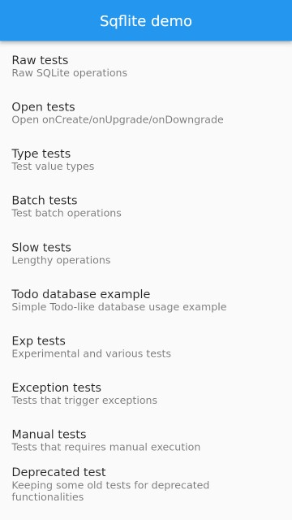

# Sqflite example for Aurora OS

Demonstrates how to use the `sqflite_aurora` plugin.

## Build

```shell
# Add an alias if it doesn't already exist
alias flutter-aurora=$HOME/.local/opt/flutter-sdk/bin/flutter
# Get dependencies
flutter-aurora pub get
# Run build
flutter-aurora build aurora --release # [--release|--debug|--profile]
```

You can collect, sign, run an example on the device with a script located in the `script/build_example.sh`
More information in `build_example.sh`.

### Preview example


